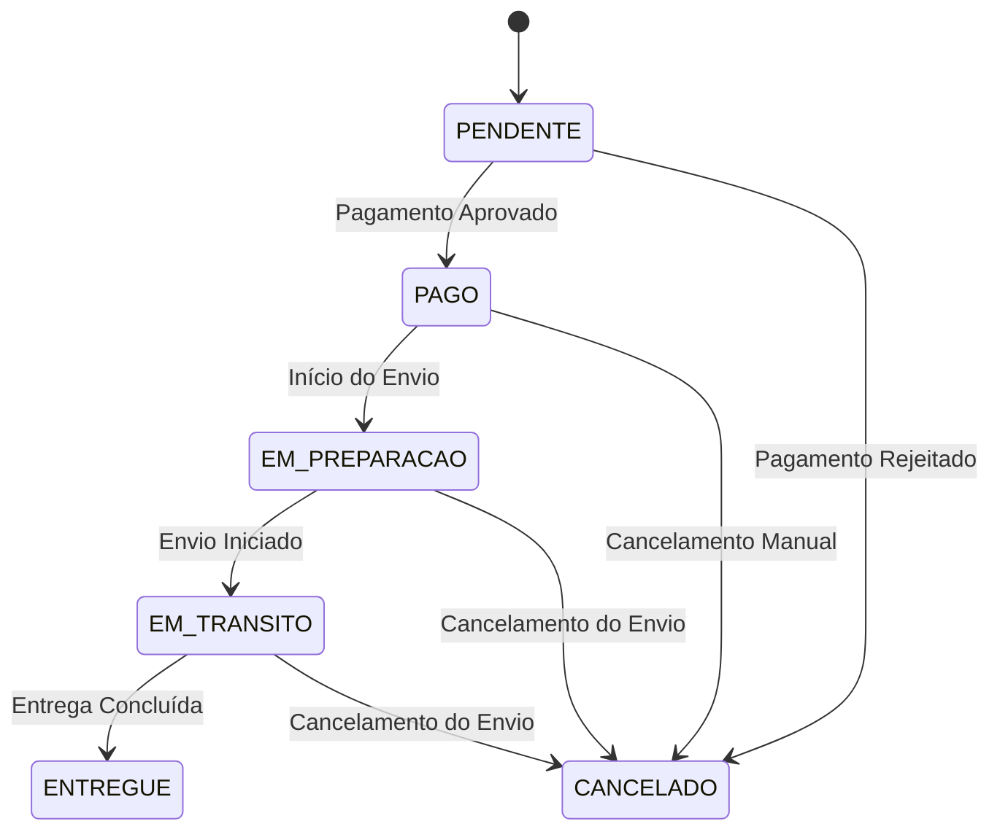

# Mapa de Consistência de Estados do Pedido

## Estados do Pedido

1. **PENDENTE**
   - Estado inicial do pedido
   - Aguardando processamento de pagamento
   - Status de pagamento: PENDENTE
   - Status de envio: PENDENTE

2. **PAGO**
   - Pagamento aprovado
   - Status de pagamento: APROVADO
   - Status de envio: PENDENTE
   - Pronto para iniciar processo de envio

3. **EM_PREPARACAO**
   - Pagamento aprovado
   - Status de pagamento: APROVADO
   - Status de envio: EM_PREPARACAO
   - Pedido sendo preparado para envio

4. **EM_TRANSITO**
   - Pagamento aprovado
   - Status de pagamento: APROVADO
   - Status de envio: EM_TRANSITO
   - Pedido em transporte para entrega

5. **ENTREGUE**
   - Pagamento aprovado
   - Status de pagamento: APROVADO
   - Status de envio: ENTREGUE
   - Pedido finalizado com sucesso

6. **CANCELADO**
   - Pode ocorrer em qualquer estado
   - Causas:
     - Pagamento rejeitado
     - Cancelamento do envio
     - Cancelamento manual

## Transições de Estado

## Regras de Consistência

1. **Pagamento**
   - Pedido só pode sair de PENDENTE após confirmação de pagamento
   - Pagamento rejeitado sempre leva ao estado CANCELADO
   - Pagamento aprovado é pré-requisito para qualquer estado de envio

2. **Envio**
   - Só pode iniciar após pagamento aprovado
   - Estados de envio são sequenciais: EM_PREPARACAO -> EM_TRANSITO -> ENTREGUE
   - Cancelamento do envio em qualquer etapa leva ao estado CANCELADO

3. **Cancelamento**
   - Pode ocorrer em qualquer estado
   - Estado final, não permite retorno
   - Deve registrar motivo do cancelamento

## Validações

1. **Criação do Pedido**
   - Estado inicial: PENDENTE
   - Status de pagamento: PENDENTE
   - Status de envio: PENDENTE

2. **Processamento de Pagamento**
   - Validação de dados do pagamento
   - Atualização do status de pagamento
   - Transição para PAGO se aprovado
   - Transição para CANCELADO se rejeitado

3. **Processamento de Envio**
   - Validação de pagamento aprovado
   - Sequência correta dos estados de envio
   - Atualização do status de envio
   - Transição para estados correspondentes

4. **Cancelamento**
   - Validação de permissão para cancelamento
   - Registro do motivo
   - Atualização para CANCELADO
   - Notificação aos serviços envolvidos 